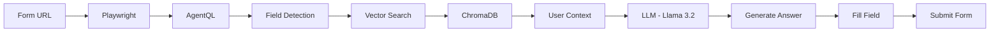

<div align="center">

# 🤖 FormAI

### AI-Powered Job Application Form Filling Bot

*Automate your job applications with intelligent form completion*

[](https://nodejs.org/)
[](https://playwright.dev/)
[](https://www.langchain.com/)

</div>

---

## 📋 Overview

**FormAI** is a Node.js-based service that automates the process of filling job application forms. Simply provide the form URL, and the bot handles the rest - from field detection to intelligent response generation and form submission.

## ✨ Features

- 🎯 **Automatic field detection** and classification
- 🧠 **Context-aware response generation** using RAG pipeline
- 🔒 **Local LLM for privacy** - your data stays on your machine
- 📝 **Automatic form submission**
- 🔄 **Support for various form types**
- 💾 **Custom user data embeddings**

---

## 🚀 How It Works



1. **Form Navigation**: Receives form URL via API endpoint and opens it using Playwright
2. **Field Detection**: AgentQL dynamically identifies and extracts form fields
3. **Context Retrieval**: Uses RAG pipeline with similarity search to find relevant user data based on field labels
4. **Response Generation**: LLM generates appropriate answers using retrieved context
5. **Form Completion**: Bot fills fields and automatically submits the form

---

## 🛠️ Technology Stack

| Component | Technology |
|-----------|-----------|
| 🤖 **LLM** | Llama 3.2 (via Ollama) |
| ⚙️ **Backend** | Node.js + Express |
| 💾 **Vector Store** | ChromaDB |
| 🔢 **Embeddings** | MiniLM-L6-V2 |
| 🔗 **LLM Framework** | LangChain |
| 🌐 **Browser Automation** | Playwright |
| 🏷️ **Element Detection** | AgentQL |

---

## 📦 Prerequisites

Before running FormAI, ensure you have:

- ✅ Node.js (v16+)
- ✅ Ollama with Llama 3.2 model
- ✅ ChromaDB running locally
- ✅ API Key for AgentQL

---

## 🔧 Installation

```bash
# Clone the repository
git clone https://github.com/anasM0hammad/formAI.git
cd formAI

# Install dependencies
npm install

# Start Ollama with Llama 3.2
ollama run llama3.2

# Start chroma
chroma run --path < path-to-your-data-location >

# Start the service
npm start
```

---

## 📡 API Usage

### 1️⃣ Add User Documents

Add user documents to the RAG data store.

**Endpoint**: `/api/create-embeddings`

**Method**: `POST`

```json
{
  "documents": [
    "John Doe, Software Engineer with 5 years of experience in Node.js",
    "Email: john.doe@example.com, Phone: +1234567890",
    "Skills: JavaScript, Python, React, Node.js, MongoDB",
    "Education: B.Tech in Computer Science from XYZ University"
  ]
}
```

**Response**:
```json
{
  "status": "success",
  "message": "Documents embedded successfully"
}
```

---

### 2️⃣ Fill Application Form

Fill and submit a job application form automatically.

**Endpoint**: `/api/query`

**Method**: `POST`

```json
{
  "href": "https://example.com/job-application-form"
}
```

**Response**:
```json
{
  "status": "success",
  "message": "Form filled and submitted successfully"
}
```

---

## ⚙️ Configuration

Configure the following in your environment:

- 🔗 Ollama API endpoint
- 💾 ChromaDB connection Host, Port and Collection name 
- 🏷️ AgentQL API key

---

## ⚠️ Limitations

- Requires form to be publicly accessible
- Works with standard HTML form elements
- Dependent on AgentQL query accuracy

---

## 🤝 Contributing

Contributions are welcome! Please open an issue or submit a pull request.

---

## ⚖️ Disclaimer

This tool is for **educational and personal use only**. Ensure you have permission to automate form submissions and comply with website terms of service.

---

<div align="center">

**Made with ❤️ by Mohammad Anas**

⭐ Star this repo if you find it helpful!

</div>